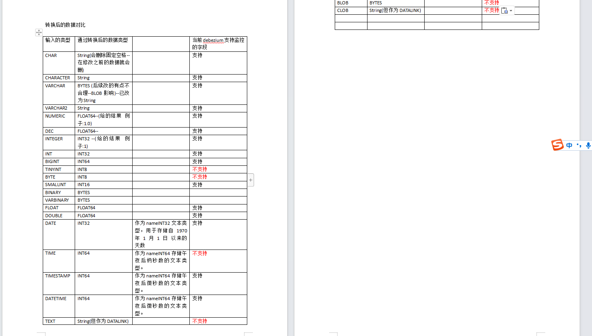

## 达梦数据库关于cdc的说明

当前测试库所在位置: 192.168.99.125:5237

所用的测试库/表: V3_DS1/TEST


### 表结构

**TEST**

| 字段名       | 字段类型             | 精度   | 
|-----------|------------------|------|
| COLUMN_1  | CHAR             | 10   |   
| COLUMN_2  | CHARACTER        | 10   |     
| COLUMN_3  | VARCHAR          | 50   |     
| COLUMN_4  | VARCHAR2         | 50   |     
| COLUMN_5  | NUMERIC          | 22,6 |     
| COLUMN_6  | DEC              | 22,6 |      
| COLUMN_8  | INTEGER          |      |     
| COLUMN_9  | INT              |      |      
| COLUMN_10 | BIGINT           |      |     
| COLUMN_11 | TINYINT          |      |     
| COLUMN_12 | BYTE             |      |     
| COLUMN_13 | SMALLINT         |      |     
| COLUMN_14 | BINARY           | 10   |     
| COLUMN_15 | VARBINARY        | 50   |      
| COLUMN_16 | FLOAT            |      |     
| COLUMN_17 | DOUBLE           |      |      
| COLUMN_18 | REAL             |      |    
| COLUMN_19 | DOUBLE PRECISION |      |      
| COLUMN_20 | DATE             |      |     
| COLUMN_21 | TIME             | 6    |      
| COLUMN_22 | TIMESTAMP        | 6    |     
| COLUMN_23 | DATETIME         | 6    |      
| COLUMN_26 | TEXT             |      |      
| COLUMN_27 | BLOB             |      |      
| COLUMN_28 | CLOB             |      |     

达梦字段类型说明: [达梦字段类型说明](https://eco.dameng.com/document/dm/zh-cn/sql-dev/dmpl-sql-datatype.html#%E5%8F%82%E8%80%83%E6%96%87%E6%A1%A3)

### cdc测试


#### 测试1: 插入一条数据

```sql
update TEST set COLUMN_1='1221' where COLUMN_3='1';
```

#### 接收的数据

```json
{
  "beforeData": "{\"COLUMN_17\":1.0,\"COLUMN_16\":1.0,\"COLUMN_22\":1605830399000000,\"COLUMN_10\":1,\"COLUMN_13\":1,\"COLUMN_23\":1605830399000000,\"COLUMN_20\":18585,\"COLUMN_9\":1,\"COLUMN_6\":1.0,\"COLUMN_5\":1.0,\"COLUMN_8\":1,\"COLUMN_2\":\"1\",\"COLUMN_1\":\"1221\",\"COLUMN_4\":\"1\",\"COLUMN_3\":\"1\"}",
  "changeTime": 1692265216217,
  "data": "{\"COLUMN_17\":1.0,\"COLUMN_16\":1.0,\"COLUMN_22\":1605830399000000,\"COLUMN_10\":1,\"COLUMN_13\":1,\"COLUMN_23\":1605830399000000,\"COLUMN_20\":18585,\"COLUMN_9\":1,\"COLUMN_6\":1.0,\"COLUMN_5\":1.0,\"COLUMN_8\":1,\"COLUMN_2\":\"1\",\"COLUMN_1\":\"1112\",\"COLUMN_4\":\"1\",\"COLUMN_3\":\"1\"}",
  "db": "V3_DS1",
  "eventType": 2,
  "table": "TEST"
}
```

字段说明:

beforeData: 之前的数据

changeTime: 变更时间

data: 变更后的数据

db: 数据库名

eventType: 事件类型, 1: 插入, 2: 更新, 3: 删除

table: 表名

特殊说明查看: [说明文件](./doc/dm.doc)

### 达梦cdc中字段与jdbc字段的对应说明



